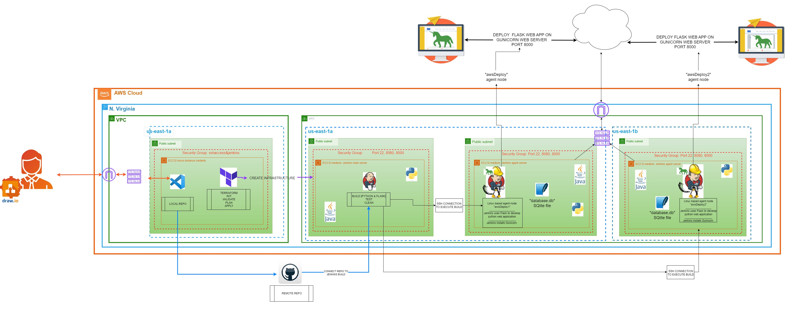

## <ins>Deployment 5.1: Retail Banking Flask Application on Gunicorn Production Environment through Jenkins and Terraform</ins>
_________________________________________________
##### Danielle Davis
##### October 21, 2023
______________________________________
### <ins>PURPOSE:</ins>
___________________
&emsp;&emsp;&emsp;&emsp;	In previous deployments, I've used one server to deploy my web applications. In this current deployment, instead of manually building, testing, and deploying on one server, I utilized Terraform to automate the creation of an infrastructure for three servers. The first server or main server was installed with Jenkins and Deadsnakes PPA for the latest Python package and its dependencies. The main server runs Jenkins where we create the agent nodes, with one of each attached to the other two instances. The second and third instances were also installed with Deadsnakes PPA along with the Java Runtime Environment(JRE) package so the server communicates properly with the Jenkins agents nodes. The [Jenkinsfile](https://github.com/DANNYDEE93/Deployment-5.1/blob/main/Jenkinsfile) and [app.py](https://github.com/DANNYDEE93/Deployment-5.1/blob/main/app.py) scripts use the agent nodes through the Jenkins main server to import Flask for development and install Gunicorn on the agent servers. The agent nodes use SSH to connect with the agent servers and the nodes run the builds and deploy on the Gunicorn production web server. Instead of using commands to establish an SSH connection in the Jenkinsfile like in my [Deployment5](https://github.com/DANNYDEE93/Deployment5.git), I accessed the SSH connection through the Jenkins agent nodes. Once installed on my Ubuntu server, the agent nodes become Linux-based and use Flask (python framework) to develop and Gunicorn to deploy my Python web application. 
 _________________________________
### <ins>ISSUES:</ins>
__________________________________
* GitHub: Merged my branches before pushing making only a main branch. I needed to create a second branch to run the build through the agent node on the third server because the main branch was running on the second instance through the IP address already. 

* Jenkinsfile: The second node wasn't working until I changed the agent node name in the Jenkinsfile in the second branch I needed to change the agent name to "awsDeploy2" and needed to change the hostname to the third instance's IP address.

* Deployment Process: After a successful test in Jenkins, my server was still unable to serve up the web application. I needed to run my Jenkins build multiple times, and upgrade my agent server, and then the application worked.
________________________________________________________________________________

### <ins> **STEPS FOR WEB APPLICATION DEPLOYMENT** </ins>

_____________________________________________________________________________
### Step 1: Create a terraform file:
__________________________________________________________________________
	
* Terraform is a great tool to automate the building of your application infrastructure instead of manually creating new instances with different installations separately. For this application, I wrote a terraform [main.tf](https://github.com/DANNYDEE93/Deployment-5.1/blob/main/main.tf) file script in VS code. I created a main.tf file with defined variables and scripts for installation. For the first instance, the user data was connected to my [Jenkins script](https://github.com/DANNYDEE93/Deployment-5.1/blob/main/jenkins.sh) to build and test my deployment. In the other two instances, the user data was connected to my [software script](https://github.com/DANNYDEE93/Deployment-5.1/blob/main/software.sh) with the latest version of Python and automates the installation of dependencies for the python virtual environment. Including these scripts in the user data allowed me to automate their execution when Terraform created the instances. I also used a fourth server installed with [VS code](https://github.com/DANNYDEE93/Deployment5/blob/main/vscode.sh) and [Terraform](https://github.com/DANNYDEE93/Deployment5/blob/main/installterraform.sh) to use terraform in vs code to push to my remote Github repo. My main.tf file created an infrastructure that included: 

**1 VPC: virtual private cloud to house the infrastructure elements*

**2 Availability Zones: chosen by referring back to the region in the subnets resource*

**2 Public Subnets*

**3 EC2 Instances in each subnet*

**1 Route Table: with route table association resource block to connect route table to subnets and internet gateway*

**1 Internet Gateway* 

**1 Security Group (with ports: 22 for SSHing, 8080 for Jenkins main server, and 8000 for Gunicorn production web server)*

_____________________________________________________________________

<ins>Terraform steps to create infratructure </ins>

* **Terraform init:** to initialize terraform and the backend configurations

* **Terraform validate:** to validate that the terraform file is configured properly

* **Terraform plan:** to show exactly what will be created when applied

* **Terraform apply:** to execute infrastructure script

______________________________________________________________________________
### Step 2: Git commits & Repo Changes 
__________________________________________________________________________

* Used VS code on my fourth instance and GitHub to make changes in my local repository. I added my GitHub URL in my .git config file to give the code editor permission to push changes to my remote repo on GitHub. I changed the agent name in the Jenkinsfile in the second branch, created my main.tf script, and included my scripts to download the applications I needed for my deployment and pushed my changes without merging so that each node could connect to their corresponding servers.
  
________________________________________________
### Step 3: Configure and Run Jenkins Build
__________________________________________________________

* Create Jenkins **Multibranch Pipeline** to build staging environment: Find instructions to access Jenkins in the web browser, create a multibranch pipeline, and create a token to link the GitHub repository with the application code to Jenkins [here](https://github.com/DANNYDEE93/Deployment4#step-8--create-staging-environment-in-jenkins). 

**app.py**: utilizes Flask for generating the web page, uses SQLAlchemy to connect with SQLite database, and uses rest APIs to render necessary information for customers, accounts, transactions, etc. of a banking web application.

**test_app.py**: imports the Flask app object to test the home page route, checks that the web application server is running correctly, and responds with a 200 success code.

* [Instructions on how to create agent nodes in Jenkins.](https://scribehow.com/shared/Step-by-step_Guide_Creating_an_Agent_in_Jenkins__xeyUT01pSAiWXC3qN42q5w) *See the importance of the agent nodes explained further below.*

____________________________________________________________________________
### Step 5: Gunicorn Production Environment on Web Application Server
__________________________________________________________________________

* Gunicorn, installed in our Jenkinsfile application code, acts as my application's production web server running on port 8000 through the Jenkinsfile. The flask application, installed through the app.py and load_data.py scripts, uses Python with Gunicorn to create a framework or translation of the Python function calls into HTTP responses so that Gunicorn can access the endpoint which, in this case, is my web application HTTPS URL provisioned through the IP addresses of the agent servers.
__________________________________________________________________________

* In this deployment, the Jenkins agent nodes separate the responsibilities among multiple servers so the main server can focus on configurations and the **Pipeline Keep Running Steps** plugin, while the agent servers do the actual building of the application to handle configuration drift. The main Jenkins server delegates work to the agent nodes making it easier to scale my builds across multiple machines when necessary to handle resource contention and increase performance. Agent nodes also continuously run builds so if my main server goes down, the application can still initialize for deployment. Utilizing agent nodes is essentially installing a virtual machine on my EC2 virtual machine which increases allotted CPU, RAM, and MEM resources to increase the speed of my running processes.
_______________________________________________________________________________

<ins> **[Jenkinsfile](https://github.com/DANNYDEE93/Deployment-5.1/blob/main/Jenkinsfile):** </ins>

<ins> ***Build Stage:** </ins> Prepares python(-venv) virtual environment by installing a python-pip package and Flask to develop the web application, and uses [load_data.py](https://github.com/DANNYDEE93/Deployment-5.1/blob/main/load_data.py) to load the sample data and *

<ins> ***Test(Validation) Stage:** </ins> Activates python -venv, installs and runs pytest for testing and archiving log reports in a JUnit results file*

<ins> ***Clean Stage:** </ins> Kills any old Gunicorn processes on the agent servers from previous builds to ensure we start with a clean deployment environment with our attached agent node*

<ins> ***Deploy stage**: </ins> Activates python -venv, installs Gunicorn, runs the [database.py](https://github.com/DANNYDEE93/Deployment-5.1/blob/main/database.py) script to import required SQLAlchemy libraries to store data in a **database.db** SQLite file, and initializes the Flask web application through Gunicorn in daemon mode*

* Since Gunicorn is running as a background process, the agent servers have more capacity to handle multiple tasks &e separately and simultaneously.
    
* Decreases latency because even if the SSH session is closed, the web app can continuously run, restart, or stop the application when necessary. 
       
* The main server's resources are balanced because Gunicorn can independently run its processes to handle more requests at a time. 
	
* Gunicorn is configured to output log files and metrics in JUnit format. 

<ins> ***Reminder stage:** </ins> Confirmation to the developer that the application is running on deployed on  web server*

 

* Copy and paste the public IP address of the agent servers and port 8000 **<ip_address:8000>** to run the deployment in a new browser. Again, this is established through the installations and dependencies that are connected to the agent nodes on each agent server.

___________________________________________

### <ins>SYSTEM DIAGRAM:</ins>
_________________________________________________

_________________________________________________

### <ins>OPTIMIZATION:</ins>
_____________________________________________

&emsp;&emsp;&emsp;&emsp;	Jenkins was particularly important in the optimization and error handling of the deployment. The Jenkins server is accessible through port 8080, while the web server is accessible by our banking customers through port 8000. The Jenkins application server should be placed in a private subnet with a map to an NACL in a terraform file. We don't want users to access the installations and dependencies needed to ensure the stability of the web application server. The agent servers/ web production servers should stay in the public subnet so that users can have reliable access to the Gunicorn web servers provisioned on them.

&emsp;&emsp;&emsp;&emsp;	Having one server for building and testing and using the other servers for deploying ensures that there won't be performance issues from running out of disk space on the instances from resource contention. Having everything done on one server like in previous deployments and if the server goes down, it can lead to a negative user experience, makes it harder for the development team to troubleshoot where the issue is coming from, and can cause configuration drift because having a single server responsible for the whole deployment process leaves the server with less capacity to ensure proper configuration of the necessary applications and dependencies to deploy the application.  

<ins> **Other ways to optimize and increase user availability of my deployment:** </ins>

<ins>1. Enhancing the automation of the AWS Cloud Infrastructure:</ins> 

 * Implementing Terraform modules(reusable infrastructure definitions to reduce error and increase efficiency). 

 * Including private subnet for the application/ Jenkins server to increase security and availability by protecting my Jenkins application server from unauthorized access.

 * Including "aws_autoscaling_policy" resource to scale up or down as needed (ex. when resources like CPU reach a certain utilization), detect unhealthy instances and replace them, and automate recovery by redeploying failed instances.

<ins>2. Error handling:</ins> Create webhook to automatically trigger Jenkins build when there are changes to my GitHub repository to detect if any changes disrupt or optimize my deployment, reduce the risk of latency, and fix bugs for faster deployments. 

<ins>3. Using a cloud-based Jenkins agent:</ins> In this deployment, my Jenkins agent nodes are running with the AWS cloud. While using multiple cloud providers can be more complex and costly, it comes with greater flexibility so you don't have to be locked in with one vendor or provider, and improved reliability and performance as different providers come with different advantages and resources.

<ins>4. Using a containerized Jenkins agent:</ins> 

 * Simplified management: Containerized and cloud-based Jenkins agents are easier to manage than traditional Jenkins agents because you do not need to install and maintain Jenkins on each machine.

 * Increased scalability: Easier to add or remove Jenkins agents as needed, reducing resource contention.

 * Reduced costs because you can run multiple Jenkins agents on the same machine or in the cloud, reducing the need for multiple virtual machines/ec2 instances.

 * Reduced complexities with configurations.
